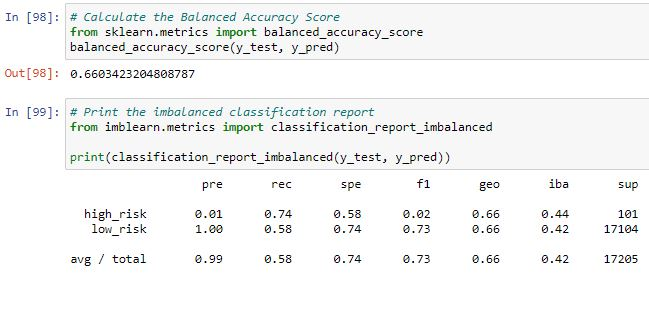

# Credit_Risk_Analysis

## Overview of Analysis

The purpose of this analysis was to apply machine learning models to understand credit card risk. I used the imbalanced-learn and scikit-learn libraries to which is better at predicting credit risk: RandomOverSampler, SMOTE, or ClusterCentroids. I used these to resample the dataset, view the count of my target classes, train a logistic regression classifier, calculate a balanced accuracy score, generate a confusion matric, and generate a classification report.

## Results:

- Random Over Sampler
  - Accuracy: 0.660342
  - Precision: high_risk: 0.01 low_risk 1.00
  - Recall: high_risk: 0.74 low_risk 0.58
  - The random over sampler had an accuracy of 0.66 and had a precidion of 0.01 for high risk and 1.00 for low risk. The recall, or sensitivity, for high risk is 0.74 and low risk is 0.58. 
  
- SMOTE Oversampling
  - Accuracy: 0.653731
  - Precision: high_risk: 0.01 low-risk 1.00
  - Recall: high_risk: 0.62 low_risk 0.68

- ClusterCentroids Undersampler
  - Accuracy: 0.547471
  - Precision: high_risk: 0.01 low_risk: 1.00
  - Recall: high_risk: 0.68 low_risk: 0.41

- SMOTEEN
  - Accuracy: 0.644799
  - Precision: high_risk: 0.01 low_risk: 1.00
  - Recall: high_risk: 0.72 low_risk: 0.57

- Balanced Random Forest Classifier
  - Accuracy: 0.678159
  - Precision: high_risk: 0.95 low_risk: 1.00
  - Recall: high_risk: 0.36 low_risk: 1.00
  
- Easy Ensemble AdaBoost Classifier
  - Accuracy: 0.933823
  - Precision: high_risk: 0.09 low_risk: 1.00
  - Recall: high_risk 0.92 low_risk: 0.95

## Summary:  

The machine learning model that I believe performed best was the Easy Ensemble AdaBoost Classifier. It had the highest accuracy score of 0.93 and had a recall score of 0.92 for high_risk and 0.95 for lwo risk, which are both acceptable. Where it falls short, however, is with the precision where it only had 0.09 for high_risk. With this in mind, I think it would be best to search for a model that fits better for the data we have. This means that the positive classification of high risk is not reliable with this model. 